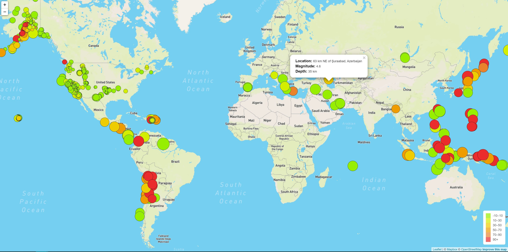
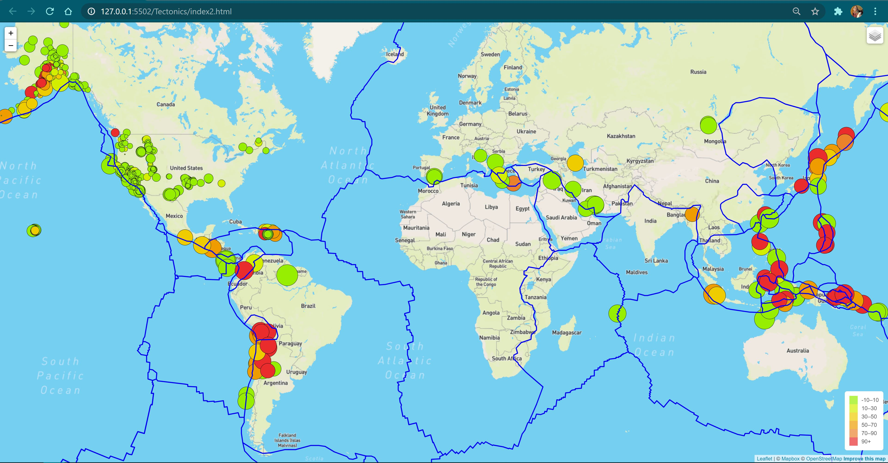
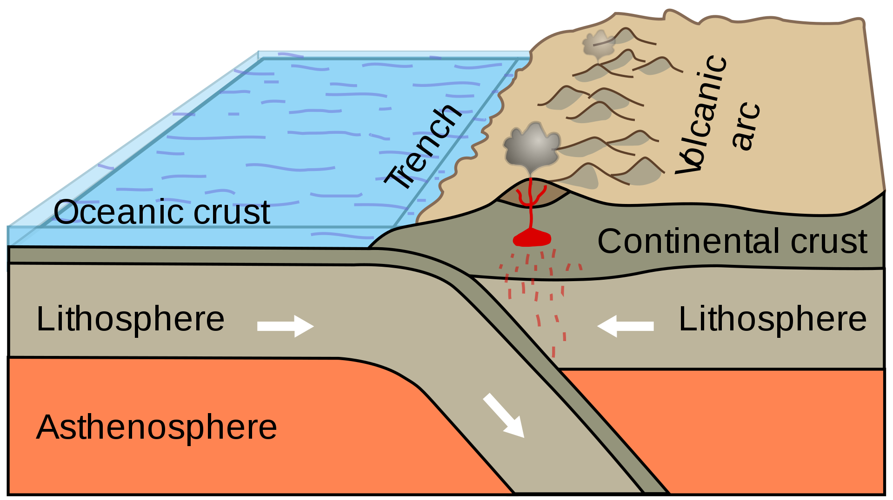
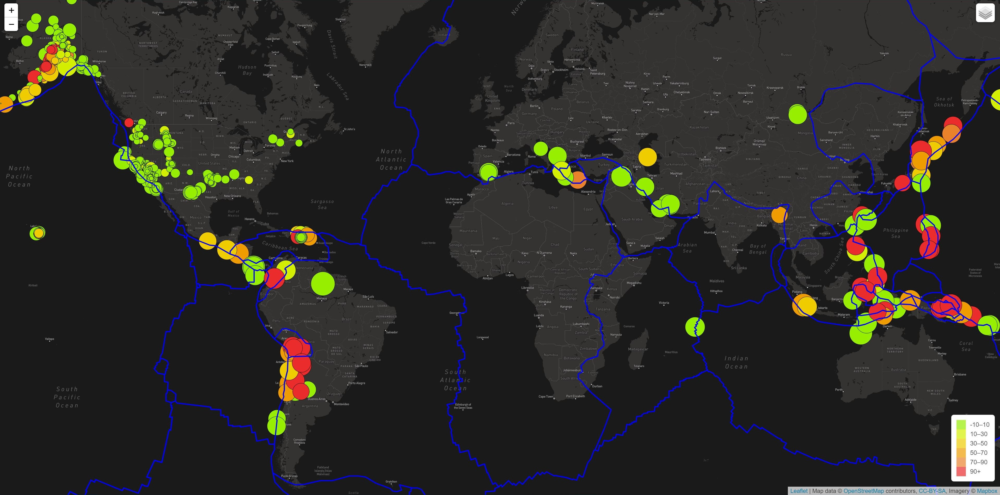
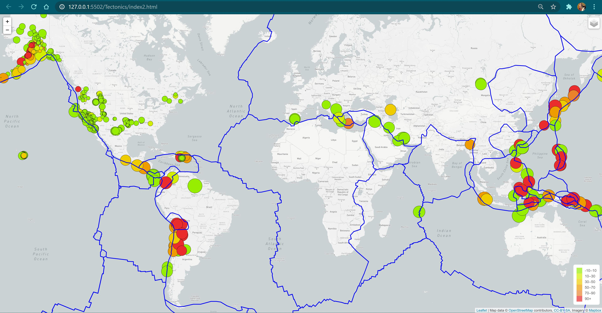
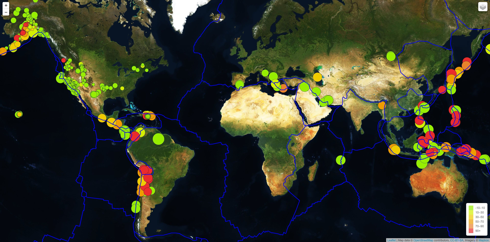
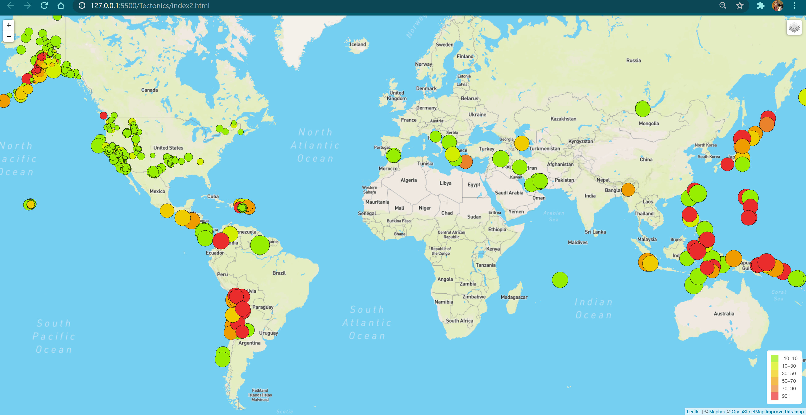
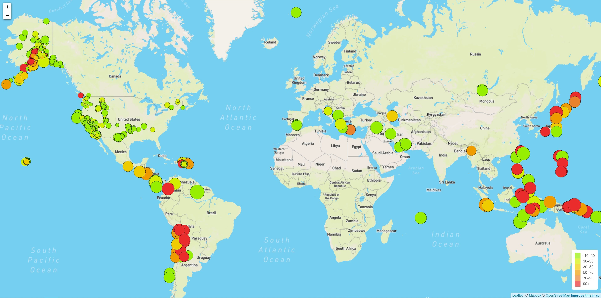

# Mapping Seismic Activity

## Background
The United States Geological Survey, or USGS, is responsible for providing scientific data about natural hazards, the health of our ecosystems and environment; and the impacts of climate and land-use change. Their scientists develop new methods and tools to supply timely, relevant, and useful information about the Earth and its processes. 

The USGS is interested in building a new set of tools that will allow them visualize their earthquake data. They collect a massive amount of data from all over the world each day, but they lack a meaningful way of displaying it. Their hope is that being able to visualize their data will allow them to better educate the public and other government organizations (and hopefully secure more funding) on issues facing our planet.

- - -
## Objective: 
Visualize Earthquake occurrences and association with plate tectonics. 
- - -

## Methods
### Earthquake Occurences
#### 1. Get data
   The USGS provides earthquake data in a number of different formats, updated in 5 minute increments. Visit the [USGS GeoJSON Feed]       (http://earthquake.usgs.gov/earthquakes/feed/v1.0/geojson.php) page. Click on data set and capture URL of the JSON representation provided. 
#### 2. Import & Visualize the Data
   Using Leaflet, create a map that plots earthquakes using the longitude and latitude of the epicenters.
   * Data markers should reflect:
      * magnitude of the earthquake by the size of the marker
      * depth of the earthquake's focus by color of the marker
   * Popups provide additional information about the earthquake when a marker is clicked.
   * Provide context for your map data by creating a legend
   

### Tectonic Plates
#### 1. Get data
   Add additional data to illustrate relationship between tectonic plates and seismic activity. Data on tectonic plates can be found [here](https://github.com/fraxen/tectonicplates). 
   * Add data to the original map with the following:
      * Plot the tectonic plates on the map
      * Add a number of options for the base map to choose from as well as separate out our 
      * seperate the two data sets into overlays that can be turned on and off independently.
      * Add layer controls to our map.

- - -  
## Analysis
#### Default Base Map overlayed with Tectonic Plate and Earthquakes Layers

#### Observations: 
1. Generally, yes, there appears to be a strong relationship between tectonic plates and earthquake localities.
2. Deeper earthquakes commonly occur in oceanic regions, while shallower earthquakes occur on continental crust. 
3. Moving inland, the earthquakes become smaller and shallower. This trend is likely exaplined by the cratonic region of the continental plates. The craton is the oldest and most tectonically stable area of a continental shield. 
4. Earthquakes occur among mountain ranges, such as the Cascade Mountains, Rockie Mountains and the Andes Mountains. 
   * However, no earthquakes are observed in the Himalayan Mountains, despite being along a convergent plate boundary, suggesting a convergent boudnary between two continental        plates are more tectonically stable. 
   * Additionally, earthquakes seldomly occur along the Blue Ridge range and the greater Applachian Mountains. These mountain ranges were formed nearly a billion years ago and        are significantly older than the Rockie Moutains that are dated at 50-80 million years old. This suggests, the age of a mountain ranges influences it's tectonic stability.
   * Lastly, the lithology of the underlying rock units in a mountain range should play a significant role in stability. 
5. Deeper earthquakes are located near at subduction zones, where one tectonic plate, is being submerged under another, as seen in the infographic below. Subduction commonly occurs between oceanic and continental plates due to a density defential. Oceanic Crust is basltic with a high iron content, while continental is felsic and having less dense mineralogy. Subduction zones can form deep sea trenches, such as the Mariana trench along the Mariana Island near Guam. It is along these subduction zones that the deepest, most extreme earthquakes originate. 

  

6. The majority of earthquakes occur along the boundary of the Pacific Plate. This region is nicknamed, "Ring of Fire", is comprised of, almost entirely of subduction zones, as illustrated in the below map by Stegman in Schellart et al. (2011). When deep subductions adjust, an earthquake occurs and the displacement of water causes massive tsunamis.   

  

7. Despite Hawaii being located near the center of the Pacific Plate, it experiences a significant number of Earthquakes for it's quaint surface area. While Hawaii is not located on tectonic plate boundaries, it is located above a volcanic hotspot. The volcanism in Hawaii is very active and can alone, be the source of earthquakes, but also, as volcanoes erupt, the magma chamber empties creating air pockets that collapse under the weight the earth's crust intitiating deep structiral adjustments. Most earthquakes in Hawaii go unnoticed, but in the most volcanically active region of "The Big Island", the depth of the focus is 30-36 Kilometers deep. 

#### Recommendations:
1. Data does not show earthquakes along Mid-Atlantic Ridge, a divergent plate boundary, despite there being thousands of transfrom boundaries perpendicular to the ridge. This may indicate a gap in data and where additional study should occur. 
2. To better correlate the focus of the earthquakes with the geologic features and surface characteristics, a map created with Light Detection and Ranging (LIDAR), both topograhic and bathymetric, remote sensing should be incorporated into this map. 
3. To better visualize the influence of tectonics has on natural disasters, more than earthquakes must be considered, such as volcanism, mountain building, tsunamis, and additionally, earthquakes caused by human inference of the earth's geological processes.
4. The direction and speed of the plates, much like Stegman's map above, should be incorporated into the map. 
5. Geologic age ranges of the continental crust should be overlayed to observe the relationship between age and tectonic stability. 

- - -
## Additional Maps
- - -
#### Dark Base Map

- - -
#### Light Base Map

- - -
#### Satellite Base Map

- - -
#### Default Base Map with Tectonic Plate Overlay

- - -
#### Default Base Map with Earthquake Overlay

